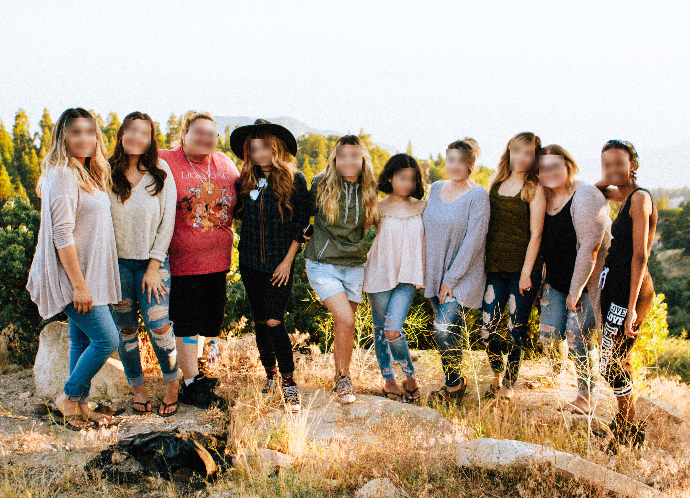

# Blurry face

Hello world!  
  

A flask project for face detection and blurring (based on the [MTCNN](https://github.com/ipazc/mtcnn) library).

## Demo

The project is currently being deployed on the Heroku platform (work in progress). It's happening [here](https://me-myself-and-blurry.herokuapp.com).

## Run locally

To run the project, clone this repository and run the app.py file. 

## Some links

* The notebook: [https://www.kaggle.com/kelvar/face-detection-and-blurring-cv2-and-mtcnn](https://www.kaggle.com/kelvar/face-detection-and-blurring-cv2-and-mtcnn)
* About the MTCNN architecture: [https://towardsdatascience.com/face-detection-neural-network-structure-257b8f6f85d1](https://towardsdatascience.com/face-detection-neural-network-structure-257b8f6f85d1)
* How MTCNN works: [https://towardsdatascience.com/how-does-a-face-detection-program-work-using-neural-networks-17896df8e6ff](https://towardsdatascience.com/how-does-a-face-detection-program-work-using-neural-networks-17896df8e6ff)
* Blurring an image with OpenCV: [https://medium.com/swlh/blurring-or-smoothing-out-images-opencv-3005cfc21cd2](https://medium.com/swlh/blurring-or-smoothing-out-images-opencv-3005cfc21cd2)

## Feedback and more

You can reach me via my [LinkedIn profile](https://www.linkedin.com/in/gaspard-kindji/).  
